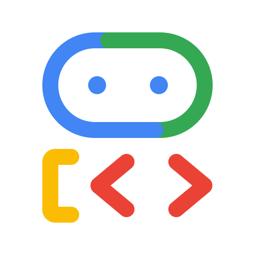

# Corporate AI Hub (Agentverse Architecture)



A comprehensive production-grade AI system demonstrating the full spectrum of **Multi-Agent Capabilities**.

## 🏗️ Grand Demo Architecture

This system follows a 5-layer model with **Dual Governance** (Global and Domain-level protection).

```text
                                +---------------------------+
                                |      USER INTERFACE       |
                                +-------------+-------------+
                                              |
+---------------------------------------------v-----------------------------------------------+
|                                     ORCHESTRATION LAYER                                     |
|                                (Corporate Hub Orchestrator)                                 |
|                                 [GLOBAL GOVERNANCE GATE]                                    |
+------+----------------------+---------------+-----------------------+-----------------------+
       |                      |               |                       |                       |
       | (Long-Term Memory)   | (A2A - Local) | (A2A - Parallel)      | (A2A - Remote)        | (A2A)
+------v--------------+  +----v----------+ +--v-----------+  +--------v-------+  +------------v---+
|  PERSISTENT STATE   |  |FINANCE DIRECTOR| | AUDIT OFFICE  |  |  HR DIRECTOR   |  |LOGISTICS AGENT |
| (SQLite Storage)    |  | (Hierarchical) | |(Parallel Exec)|  | (Remote Service)|  | (Custom MCP)   |
+---------------------+  +-------+-------+ +------+-------+  +--------+-------+  +-------+--------+
                                 |                |                   |                  |
                                 |                |          (Discovery Protocol)        |
                                 |                |                   |                  |
                                 |                |          +--------v--------+         |
                                 |                |          |  JOBS SERVICE   |         |
                                 |                |          | [DOMAIN GATE]   |         |
                                 |                |          +--------+--------+         |
+--------------------------------v----------------v-------------------v------------------v-------+
|                                    MANAGED TOOLING (MCP)                                    |
+----------------------+----------------------+------------------------+-----------------------+
|     MCP TOOLBOX      |    SPANNER NATIVE    |      CUSTOM MCP        |      CUSTOM MCP       |
|    (Cloud SQL)       |     (Endpoints)      |      (Currency)        |       (Weather)       |
+----------+-----------+----------+-----------+-----------+------------+-----------+-----------+
           |                      |                       |                        |
+----------v----------+  +--------v-------+      +--------v-------+       +--------v-------+
|      CLOUD SQL      |  |     SPANNER    |      |    EXTERNAL    |       |    OPEN-METEO   |
|     (PostgreSQL)    |  |  (PropertyGraph)|      |   EXCHANGE     |       |    REST API     |
+---------------------+  +----------------+      +----------------+       +----------------+
```

## 🛡️ Dual Governance Model

This repo demonstrates "Zero Trust" agent architecture:

1.  **Global Gate (Orchestrator)**: Enforces cooldowns and blocks high-risk terms (PII) before any delegation happens.
2.  **Domain Gate (Service-side)**: The Jobs Service has its own `JobsDomainSentinel`. Even if someone bypasses the Orchestrator and calls the service directly, the sentinel blocks unauthorized access to sensitive data (e.g., "Executive Salaries").

## 🌟 Execution Paths

1.  **Local Monolith (`make run-a2a`)**: Orchestrator and all agents run in one process.
2.  **Remote A2A (`make run-jobs-service` + `make run-a2a-remote`)**: Demonstrates discovery, remote delegation, and service-side governance.

---

## 🧠 Key Capabilities Demonstrated

1.  **Remote Discovery**: Using `RemoteA2aAgent` to link agents across network boundaries.
2.  **Hierarchical Routing**: Master Hub $\rightarrow$ Finance Director $\rightarrow$ Risk Analyst.
3.  **Iterative Looping**: The Risk Analyst follows a `Gather -> Audit -> Refine` protocol.
4.  **Parallel Execution**: Simultaneous Compliance and Legal scans.
5.  **Hybrid Memory**: Persistent SQLite storage for cross-session state.
